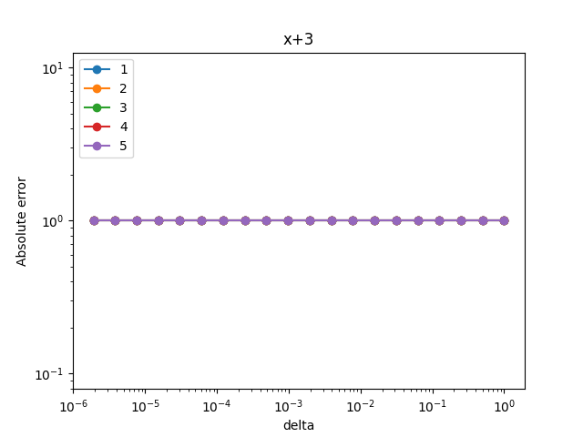

# Лабораторная работа №1 по курсу вычислительная математика

## Задание

Численно прподифференцировать заранее заданные функции:
- sin(x^2)
- sin(cos(x))
- exp(sin(cos(x)))
- x+3
- ln(x+3)
- (x+3)^(0.5)

С помощью методов различных порядков. Для методов сравнить убывание абс. погрешности с уменьшением h-параметра.

## Результаты

В результате выполнения работы получил следующие графики в логарифмическом масштабе для функций (функции подписаны в заголовках картинок)
Для линейной функции отображается  'абс погр + 1'

.png) 

).png)

)).png)

.png)

.png)

## Вывод

Исходя их полученных результатов можем заявить о совпадении с теорией (с ростом порядка метода увеличивается наклон графика, затем достигнув некоторой нижней точки погрешность устанавливается). Для линейной функции погрешность отсутствует.

#### Выполнил Лев Прошлецов, МФТИ, 2023 год
