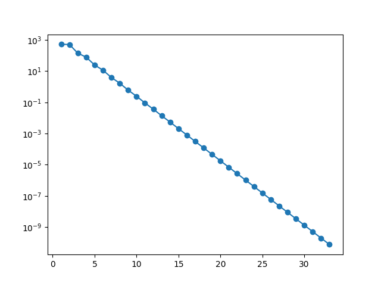
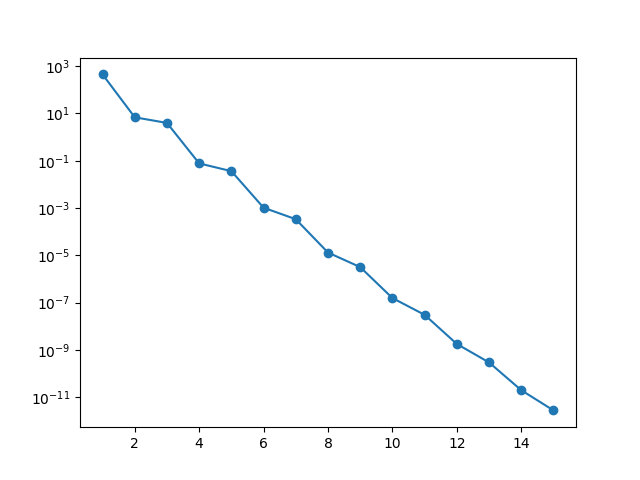
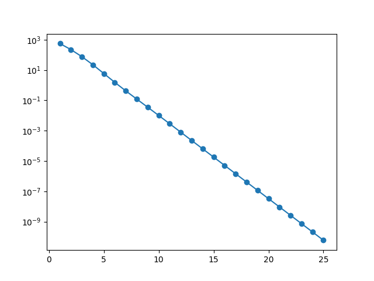

# Лабораторная работа №2 по курсу вычислительная математика

## Задание

Решить СЛАУ c помощью методов Гаусса, LU разложения, Якоби, Зейделя, верхней релаксации

С помощью методов различных порядков. Для методов сравнить убывание абс. погрешности с уменьшением h-параметра.

## Результаты

В результате выполнения работы получил следующие графики в логарифмическом масштабе для убывания невязки для итерационных методов

Метод Якоби:

 

Метод Зейделя:

Метод верхней релаксации:

Так же получившиеся невязки решений для Гаусса и LU:

Gauss = 3.1376371938784273e-13

LU = 0.8249149571305296

#### Выполнил Лев Прошлецов, МФТИ, 2023 год
